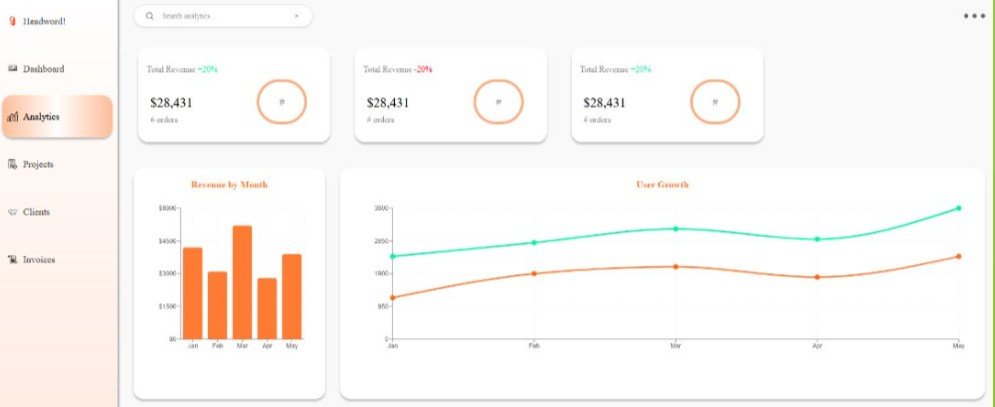
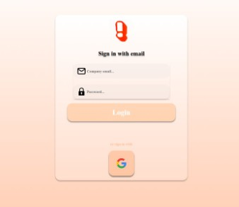

# Team BuzzWare

  

# csc-190-191-systemy
CSUS Senior Project by: Thomas Kone, Xavier Umeda, Tuan Ton, Rachel Shindelus, Shing Trinh, Isaac Sclafani, Serjeoh Nakata, Tyrice Woods 

# Branching/Merging Strategy
The `main` branch is the parent branch, the most current version of the application resides here.

Branches should be created by a developer when they are assigned a specific ticket in Jira.

Branch name should be named `sys-#/description-of-card` and spun off of branch `main`.

When acceptance criteria of the card has been met and is ready for review, developer must open a Pull Request, targeting `main`.
The pull request must then be reviewed and approved by another developer if everything checks out. PR reviewer can also leave feedback or criticism as they wish.

This process ensures that developers can get more comfortable with all parts of the codebase as well and as operating as a basic QA proccess.

# Instructions to Run Project Locally
This repository contains both the frontend and backend source code for the project.
## FRONTEND
Navigate to the local backend directory. Example: "\Users\student\Downloads\CSC 190\frontend"
- cd frontend

(Only need once to download necessary packages for React)
- npm install

Start running the frontend at http://localhost:3000/
- npm run dev

Can view the frontend in browser by navigating to:
- http://localhost:3000/

## BACKEND
Navigate to the local backend directory. Example: "\Users\student\Downloads\CSC 190\backend"
- cd backend

(Only need once to download necessary packages for React)
- npm install

Copy the env template and fill in your values:
- cp .env.example .env

Required env variables (see `.env.example` for the full list):
- `SUPABASE_URL` / `SUPABASE_ANON_KEY` — Supabase project credentials
- `CONTACT_FORM_SECRET` — shared secret for external contact form submissions

Begin running the backend at http://localhost:3001/
- npm run start OR npm run start:dev

# External Contact Form Integration
The CRM accepts contact form submissions from external client websites via `POST /clients/contact`, authenticated with a shared secret (`X-Api-Secret` header).

Currently integrated with:
- **lightfold.tv** (Squarespace) — Google Apps Script bridges form submissions from a Google Sheet to the CRM. See [`docs/squarespace-apps-script.js`](docs/squarespace-apps-script.js).
- **headword.co** (WordPress / Gravity Forms) — PHP snippet via WPCode plugin sends form data directly to the CRM. See [`docs/headword-gravity-forms-setup.md`](docs/headword-gravity-forms-setup.md).

# Synopsis of Our Project
Headword CRM is a full-stack client management platform with its purpose being to provide workers ease and efficiency in working with 
their clients. Providing a beautiful and functional dashboard page, including necessary and greatly beneficial analytics to efficiently 
track clients, interactions, deliverables, tagging, tasks, and internal workflow. 

# Testing Documents

  <a href="docs/Sys-112-114-115-116 Testing.pdf">📄 Sys 112/114/115/116 Testing</a>

  <a href="docs/Testing For Sprint03- Search Bar and Filtered Search Results.pdf">
    📄 Sprint 03 – Search Bar & Filter Tests
  </a>

  <a href="docs/Testing for Sprint2_Authentication and Verification_CSC190.pdf">
    📄 Sprint 2 – Auth & Verification Tests
  </a>

# Jira Timeline + Milestones
## Sprint 5 (Feb 8th -> Feb 21st, 2025)
### Creating the Client Profiles. 
This sprint focuses on building the foundation of the client management system. Our team will implement the UI and backend structures needed to create, store, and display detailed client profiles. This includes key data fields, layout decisions, and the initial version of the client detail view.

## Sprint 6 (Feb 22nd -> Mar 7th, 2026)
### Integrating the Google Workspace.
Our team will add Google Workspace integration to streamline importing client contacts, syncing calendars, and centralizing communication. This sprint ensures that agency users can efficiently connect their Google accounts and securely access authorized data. The integration will set the groundwork for automated email and meeting tracking.

## Sprint 7 (Mar 8th -> Mar 21st, 2026)
### Creating the Backend and Finalizing the Analytics and Reports Dashboard
This sprint centers on strengthening backend APIs and implementing the analytics dashboard. Our team will build endpoints for aggregating client data and create visual insights for users, such as activity reports and performance metrics. The goal is to deliver a functional and intuitive analytics experience.

## Sprint 8 (Mar 22nd -> Apr 5th, 2026)
### Creating and Displaying AI Clients' Recommendations
This sprint introduces AI-driven recommendations based on client behavior, tags, and historical data. The system will begin generating suggestions for follow-ups, project ideas, or communication strategies. 

## Sprint 9 (Apr 6th -> Apr 18th, 2026)
### Create AI-Based Scoring
Our team will implement an algorithmic scoring system to evaluate client engagement, risk, and opportunity levels. This feature will use multiple weighted attributes to generate a clear, data-backed client score. The scoring model will help HeadWord! prioritize their workflows and guide strategic planning.

# Login and Dashboard Pictures!

  

  

